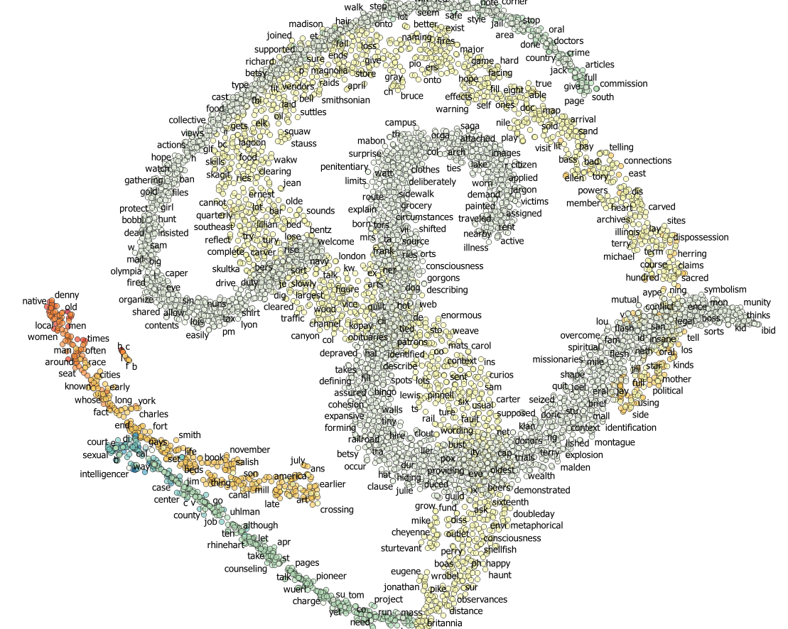

# What is "Place?"
What is "place" in the context of technological innovation and big data? First, we need to discuss the technological innovation which has influenced the conceptual definition of place to answer the question. GeoAI, GIScience, the new paradigm of joint frameworks of empirical, theoretical, and computational research, and big data are examples of innovation. GIScience concerns the use of GIS and relevant technologies such as mapping and spatial analysis while GeoAI extends GIScience with Artificial Intelligence (AI) to answer why spatial matters by creating intelligent geographic information such as image classification, object detection, scene segmentation, simulation, interpolation, link prediction, data integration, geo-enrichment, and so on (Janowicz et al., 2019).

The computational enhancement and big data have created a new paradigm by joining empirical and theoretical aspects. Four theoretical ways were introduced - the neo Marxist, the humanist, the feminist, and the performative (Agnew, 2011) explaining the conceptual change of the meaning of "place." Place is more than "space" as it is not bounded, rather complex, dynamic, and permeable. Agnew (2011) argued that place is fundamental to understanding knowledge production and dissemination since it includes the experiences of human beings as agents while the experience of place is different from different groups from the feminist perspective - pluralism.

In this regard, "place" can be discussed in the concepts of location, locale, and sense of place for empirical purposes. Deep fake of the geographic satellite image of cities discussed in the paper (Zhao et al., 2021) descr the place as the location by introducing fake images of geographic maps. The cities in the demonstration of the study are examples of the concept of location. Zhou et al. (2017), on the other hand, discussed "place" as the locale, settings of daily activities such as home, school, part, etc. by introducing Places datasets, the scene-centric datasets with three CNN architectures for classification of scenes or place. Moreover, the sense of place, the other dimension of "place" can be discussed with the feminist, humanist and performative points of view that interpret places are time-space configuration established by intersections of agents such as people and things. The analysis below presents the example of the sense of place by exploring a book author's sense of a city, Seattle through Natural Language Processing (NLP).

## Two books about Seattle
Two books related Seattle are chosen to demonstrate NLP and find any senses, perceptions, emotions of place, Seattle the authors might feel or experience. The two books are:
* Atkins, G., 2011. Gay Seattle: Stories of exile and belonging. Accessed from https://muse.jhu.edu/book/40703. University of Washington Press.
* Thrush, C., 2017. Native Seattle: Histories from the crossing-over place. Accessed from https://muse.jhu.edu/book/10411. University of Washington Press.

### Wordcloud
`Gay Seattle` has top five words freqently showing in the book. Furthermore, based on the frequency of words, word clouds are created for both books - `Gay Seattle` and `Native Seattle`. Those words are Seattle, Gay, Lesbian, Aids, and men for `Gay Seattle`.

On the other hand, `Native Seattle` has Seattle, Indian, People, Native, and Urban as the top five frequent words. 

### Social Network
`Word2Vec` from `gensim` can measure words' closeness by vectorizing words. The most common 50 words are chosen and connected to the most closed top 25 words through weighted links. Furthermore, the words are grouped in colors. The first figure is about `Gay Seattle` and the second, `Native Seattle`.

### Word Embeddings
The vectors for each word can be reduced to lower dimensions for visualization. Using `tSNE`, all words are represented by 2 dimensions - X and Y. For example, The Word Embeddeing figure of `Native Seattle` presents words to words similar to each other. The colors present the frequency of words.

Furthermore, the dimension-reduced words from `Gay Seattle` are overlapped on top of the words of `Native Seattle` by blue-green colors. Red-yellow colors represent words of `Gay Seattle`.

We need to further think about data literacy and ethics in the wave of technological innovation and big data. Deep fake and Places datasets discussed above illuminate the importance of data literacy and ethics in that technological innovation could entail the prosperity of societal gains and losses based on how to approach the technologies. Furthermore, social sensing by taking advantage of technologies such as NLP can question the ethics of digital tools while it leverages the use of user-generated digital content to better understand human dynamics.

### References

Agnew, J., 2011. Space and place. Handbook of geographical knowledge, 2011, pp.316-331.

Janowicz, K., Gao, S., McKenzie, G., Hu, Y. and Bhaduri, B., 2019. GeoAI: spatially explicit artificial intelligence techniques for geographic knowledge discovery and beyond. International Journal of Geographical Information Science: 34: 625-636

Zhou, B., Lapedriza, A., Khosla, A., Oliva, A. and Torralba, A., 2017. Places: A 10 million image database for scene recognition. IEEE transactions on pattern analysis and machine intelligence, 40(6), pp.1452-1464.

Zhao, B., Zhang, S., Xu, C., Sun, Y. and Deng, C. 2021. Deep Fake Geography? When geospatial data encounters AI. Cartography and Geographic Information Science
